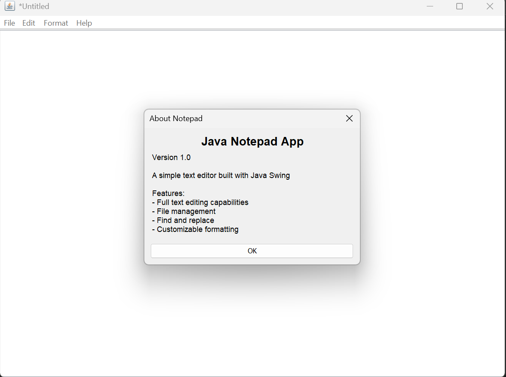

# Java Notepad App

A modern, user-friendly Notepad application built with Java Swing. This project demonstrates a full-featured text editor with a tabbed interface, file management, text editing, formatting, and search/replace capabilities.

## Features

- **Tabbed Interface**: Work with multiple documents at once, each in its own tab.
- **File Operations**: Create, open, save, and save as text files. Prompts to save unsaved changes.
- **Edit Operations**: Undo, redo, cut, copy, paste, delete, and select all. Keyboard shortcuts for all major actions.
- **Find & Replace**: Powerful dialogs for searching and replacing text, with match case support.
- **Formatting**: Word wrap toggle and customizable font (family, size, style).
- **Help & About**: Built-in help dialog and about window with app information.
- **Keyboard Shortcuts**: Familiar shortcuts (Ctrl+N, Ctrl+O, Ctrl+S, Ctrl+Z, Ctrl+F, Ctrl+H, etc.).
- **Cross-Platform**: Runs on any system with Java 17+ (configured for Java 23 in Maven).

## Getting Started

### Prerequisites

- Java 17 or higher (Java 23 recommended)
- Maven (for building and running)

### Build & Run

1. **Clone the repository:**
   ```sh
   git clone <your-repo-url>
   cd NotepadApp
   ```
2. **Build the project:**
   ```sh
   mvn clean package
   ```
3. **Run the application:**
   ```sh
   mvn exec:java -Dexec.mainClass="notepad.Notepad"
   ```
   Or run the generated JAR from `target/`.

## Project Structure

- `src/main/java/notepad/` — Main application classes
  - `Notepad.java` — Application logic and entry point
  - `NotepadFrame.java` — Main window and tab management
  - `components/` — Dialogs (About, Find, Replace)
  - `menus/` — Menu bar and menu items (File, Edit, Format, Help)
- `pom.xml` — Maven build configuration

## Usage

- **File Menu**: New, Open, Save, Save As, Exit
- **Edit Menu**: Undo, Redo, Cut, Copy, Paste, Delete, Find, Replace, Select All
- **Format Menu**: Word Wrap, Font selection
- **Help Menu**: View Help, About Notepad

## Screenshots

## Screenshots



## Author

- Wendmagegn Tajura

## License

This project is open source and available under the MIT License.

---

**Created as a demonstration project for learning Java Swing and desktop application development.**
